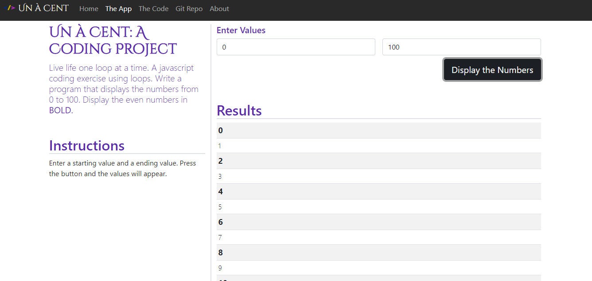

# Un-A-Cent

## Description 
Live life one loop at a time. A javascript coding exercise using loops. Write a program that displays the numbers from 0 to 100. Display the even numbers in BOLD.

## User Story
As a user, I would like an application that bolds the even numbers

## Installation

Clone Repository
- git clone https://github.com/Altheahanson/Un-A-Cent--A-coding-Project.-.git

## Technology Used: 

- Bootstrap
- HTML 5
- CSS
- Javascript

## Deployed Application Link
https://un-a-cent-a-javascript-project.netlify.app
## Images

## License
- This project is govern under the General Public v3.0 License

## Copyright
   (c) Copyright 2022 Althea Hanson 
